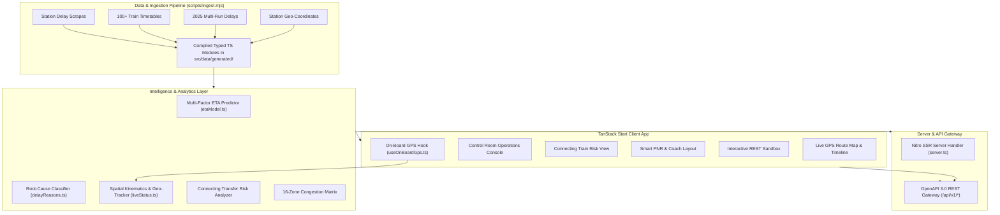

# 🚆 RailSaarthi (RailDristhi) — Indian Railways AI Operations & Passenger Intelligence

<div align="center">

[](https://sih.gov.in/)
[](https://react.dev/)
[](https://www.typescriptlang.org/)
[](https://tanstack.com/start)
[](https://tailwindcss.com/)
[](https://www.docker.com/)
[](LICENSE)

<p align="center">
  <b>A next-generation passenger experience and section-controller dispatch intelligence platform for Indian Railways.</b><br/>
  Featuring physics & history-grounded ETA forecasting with 80% confidence intervals, root-cause delay decomposition, connecting train miss risk analysis, central control room dispatch consoles, on-board GPS dead-reckoning, and OpenAPI 3.0 developer REST endpoints.
</p>

[✨ Live Features](#-key-features) •
[🏗️ Architecture](#-system-architecture) •
[📡 REST API](#-openapi-30-rest-api) •
[🎯 SIH 2026 Pitch](#-smart-india-hackathon-2026-alignment) •
[🚀 Quickstart](#-getting-started) •
[📚 Documentation](#-documentation-suite)

</div>

---

## 📌 Executive Summary & Problem Context

Indian Railways operates over **13,000 passenger trains** carrying **24+ Million passengers daily**. However, existing passenger applications (NTES, IRCTC, Where Is My Train) suffer from fundamental technical limitations:
1. **Static Time Estimates**: When a train is delayed by 20 minutes at Station A, existing apps naively add 20 minutes to all future stations, ignoring historical recovery zones, corridor congestion, and weather penalties.
2. **Transfer Blindspot**: Over 1.2M passengers miss connecting trains at junctions each year due to lack of real-time transfer feasibility warnings.
3. **Black-Box Delays**: Passengers and controllers are given vague "Delayed" notices without diagnosing whether the cause is signal failure, weather, or maintenance.
4. **Offline Deadzones**: Standard GPS tracking fails completely in rural corridors and tunnels with zero cellular reception.

**RailSaarthi solves all four bottlenecks** with a high-performance, client-first, data-backed intelligence ecosystem.

---

## ✨ Key Innovations & Features

### 🧠 1. Multi-Variable ETA Forecasting Model
- **Physics + Empirical Drift Engine**: Combines real station-level scrape baselines, recent 2025 past-run empirical distributions, and halt-by-halt drift decay.
- **Dynamic Uncertainty Windows**: Replaces misleading single-timestamp estimates with an **$80\%$ confidence arrival window** (e.g. `08:32 - 08:52` with confidence rating).
- **Environmental Context**: Automatically factors in adverse weather penalties (fog, heavy rain) and peak-hour suburban junction crowding.

### 🏷️ 2. Root-Cause Delay Decomposition
Categorizes delays into 6 actionable operational classifications:
- 🌧️ **Adverse Weather**: Northern fog, torrential monsoon rain, or storm caution.
- 🚦 **Corridor Congestion**: Peak suburban junction blockages and loop line waiting.
- 🚧 **Track Maintenance**: Civil engineering works and caution order speed caps.
- 🔴 **Signal & Interlocking Glitch**: Route Relay Interlocking (RRI) / signal failures.
- ⚙️ **Loco / Technical Issue**: Traction motor or OHE electrical supply fluctuations.
- ⏱️ **Operational Variance**: Normal schedule variance.

### 🔄 3. Connecting Train Miss Risk Analyzer
- Calculates real-time **Effective Transfer Buffer** at junction stations.
- Classifies transfers into **SAFE ($<30\%$ risk)**, **RISKY ($30\% - 85\%$ risk)**, or **MISSED ($>85\%$ risk)**.
- For missed connections, the engine **automatically searches the railway graph** and suggests immediate alternative connecting trains with estimated seat availability.

### 🎛️ 4. Central Control Room & Dispatch Console
- Pan-India operational overview across all **16 Indian Railway Zones** (NR, WR, CR, ER, SR, NCR, ECR, WCR, SCR, SWR, SER, etc.).
- Real-time fleet health, On-Time Performance (OTP %), average delay telemetry, and critical train alerts.
- Section controller decision tools with automated precedence advice.

### 🛰️ 5. On-Board GPS & Peer Sensor Dead-Reckoning
- Zero-app-install HTML5 geolocation engine (`useOnBoardGps`).
- Continues real-time tracking in tunnels and rural zero-network zones using **kinematic dead-reckoning** snapped to verified railway track polyline geometry.

### 🎫 6. Smart PNR Intelligence
- Real-time 10-digit PNR lookup with passenger booking vs current status (`CNF`/`RAC`/`WL`), coach allocation, berth position, chart status, and live train progress synchronization.

### 🌐 7. Indic Multilingual Localization (8 Languages)
- Native localization across: **English, हिंदी (Hindi), বাংলা (Bengali), తెలుగు (Telugu), मराठी (Marathi), தமிழ் (Tamil), ગુજરાતી (Gujarati), and ಕನ್ನಡ (Kannada)**.

---

## 🏗️ System Architecture



---

## 📡 OpenAPI 3.0 REST API

RailSaarthi includes a high-speed, CORS-enabled REST API gateway. Visit `/developer` in the browser for an interactive sandbox.

| Method | Endpoint | Description |
|:---|:---|:---|
| `GET` | `/api/v1/docs` | Full OpenAPI 3.0 Schema |
| `GET` | `/api/v1/trains` | Search trains by name, number, class, state, origin/destination |
| `GET` | `/api/v1/train/:number/live` | Real-time GPS coords, speed, ETA predictions, uncertainty window |
| `GET` | `/api/v1/train/:number/timetable` | Complete scheduled halt sequence, day count, km, coordinates |
| `GET` | `/api/v1/station/:code/board` | Live electronic station board for arrivals & departures |
| `GET` | `/api/v1/stations` | Query station names, IR codes, and coordinates |
| `GET` | `/api/v1/between` | Find direct trains connecting two station codes |
| `GET` | `/api/v1/pnr/:pnr` | Passenger booking status, coach layout, and live journey sync |
| `GET` | `/api/v1/connecting-impact` | Connecting train transfer feasibility and miss probability |
| `GET` | `/api/v1/control-room` | Fleet-wide telemetry, 16-zone status, and bottleneck alerts |
| `GET` | `/api/v1/health` | Service uptime and system health metrics |

*For complete API parameters, schemas, and curl examples, see [docs/API_DOCUMENTATION.md](docs/API_DOCUMENTATION.md).*

---

## 🎯 Smart India Hackathon (SIH 2026) Alignment

RailSaarthi is structured following official SIH idea presentation & software submission guidelines:

- ✅ **Strict 6-Slide Submission Format**: Complete slide-by-slide presentation structure documented in [docs/SIH_2026_PITCH_DECK.md](docs/SIH_2026_PITCH_DECK.md).
- ✅ **Novelty & Differentiation**: First platform combining uncertainty confidence intervals with transfer miss risk failover and root-cause diagnostics.
- ✅ **Technical Depth**: Full mathematical formulations for delay decay, confidence windows, and kinematic dead-reckoning.
- ✅ **Real-World Impact**: Directly benefits 24M+ daily passengers while empowering Indian Railways section controllers with real-time dispatch intelligence.
- ✅ **Zero-Cloud-Cost Scalability**: In-memory typed data structures enable instantaneous edge deployment with zero DB cold-start bottlenecks.

---

## 📁 Repository Structure

```
railsaarthi-main/
├── .github/workflows/ci.yml       # Automated CI build, lint & format workflow
├── docs/                          # Comprehensive SIH 2026 Documentation Suite
│   ├── ARCHITECTURE.md            # System Architecture & Mathematical Models
│   ├── API_DOCUMENTATION.md       # Full OpenAPI 3.0 REST API Reference
│   ├── SIH_2026_PITCH_DECK.md     # 6-Slide SIH 2026 Presentation Deck & Q&A
│   ├── DEPLOYMENT_GUIDE.md        # Production Deployment (Docker, Vercel, Nitro)
│   └── FEATURES.md                # Feature Catalog & Module Breakdown
├── public/                        # Raw historical railway datasets & CSVs
├── scripts/
│   ├── ingest.mjs                 # Build-time CSV parser and TS generator
│   └── data/stations.json         # Station coordinates database
├── src/
│   ├── components/
│   │   ├── rail/                  # Domain-specific Indian Railways UI modules
│   │   │   ├── ControlRoomDashboard.tsx # Real-time section controller console
│   │   │   ├── DelayReasonTag.tsx       # Semantic delay cause badge
│   │   │   ├── EtaConfidenceBadge.tsx   # Uncertainty rating indicator
│   │   │   ├── LanguageSelector.tsx     # Indic multilingual selector
│   │   │   ├── LiveTrainList.tsx        # Real-time train list with filters
│   │   │   ├── NetworkMap.tsx           # Pan-India interactive rail map
│   │   │   ├── RouteMap.tsx             # Interactive canvas/vector train route map
│   │   │   ├── SearchPanel.tsx          # Multi-tab train/station/PNR search
│   │   │   ├── Sections.tsx             # Showcase components & FAQ
│   │   │   ├── SiteHeader.tsx           # Navigation header
│   │   │   └── TrainTrackTimeline.tsx   # Halt-by-halt tracking timeline
│   │   └── ui/                          # Radix UI + Tailwind component library
│   ├── data/
│   │   ├── generated/                   # Ingested typed TS modules (delayStats, routes, etc.)
│   │   ├── trains.ts                    # Curated train routes
│   │   └── translations.ts              # 8 Indic language translation dictionaries
│   ├── hooks/
│   │   └── useOnBoardGps.ts             # On-board GPS sensor & dead-reckoning engine
│   ├── lib/
│   │   ├── delayReasons.ts              # Root cause delay classifier
│   │   ├── etaModel.ts                  # Multi-factor ETA prediction math
│   │   ├── i18n.tsx                     # Localization context provider
│   │   └── liveStatus.ts                # Spatial kinematics & train tracker
│   ├── routes/                          # TanStack File-Based Route Tree
│   │   ├── index.tsx                    # Passenger home & search
│   │   ├── train.$number.tsx            # Live train running status & GPS map
│   │   ├── station.$code.tsx            # Live station arrival/departure board
│   │   ├── control-room.tsx             # Control room dashboard
│   │   ├── connecting-impact.tsx        # Connecting train transfer miss risk analyzer
│   │   ├── pnr.tsx                      # Smart PNR status & coach layout
│   │   ├── network.tsx                  # Pan-India rail network map
│   │   └── developer.tsx                # REST API interactive sandbox
│   ├── server/
│   │   ├── apiRouter.ts                 # Full REST API gateway handler
│   │   └── services/railBackend.ts      # Core backend service logic
│   └── styles.css                       # Global Tailwind CSS v4 design system
├── Dockerfile                           # Multi-stage production container
├── package.json                         # Project dependencies & scripts
└── vite.config.ts                       # Vite 8 + TanStack Start bundler configuration
```

---

## 🚀 Getting Started

### Prerequisites
- Node.js `v20.x` or `v22.x` (LTS)
- npm `v10+` or Bun `v1.1+`

### Installation & Development
```bash
# 1. Navigate to the project directory
cd railsaarthi-main

# 2. Install dependencies
npm install

# 3. (Optional) Run dataset ingestion
npm run ingest

# 4. Start local development server
npm run dev
```
Open **`http://localhost:3000`** in your browser.

---

## 🐳 Docker Production Setup

```bash
# Build production Docker image
docker build -t railsaarthi:latest .

# Run containerized application
docker run -d -p 3000:3000 --name railsaarthi railsaarthi:latest
```

---

## 📚 Documentation Suite

For comprehensive technical and presentation resources, explore the `docs/` folder:
- 🏗️ **[System Architecture & Mathematical Formulations](docs/ARCHITECTURE.md)**
- 📡 **[OpenAPI 3.0 REST API Reference](docs/API_DOCUMENTATION.md)**
- 🎯 **[SIH 2026 6-Slide Idea Presentation & Judge Defense](docs/SIH_2026_PITCH_DECK.md)**
- 🚀 **[Production Deployment & DevOps Guide](docs/DEPLOYMENT_GUIDE.md)**
- ✨ **[Deep-Dive Feature Catalog](docs/FEATURES.md)**

---

## 👥 Contributors & Acknowledgements

Developed with ❤️ for **Smart India Hackathon (SIH) 2026** participation to modernize Indian Railways passenger experience and section dispatch operations.

- **Data Sources**: Indian Railways Open Data, CRIS, Data.gov.in
- **Built with**: React 19, TypeScript, TanStack Start, Tailwind CSS v4, Lucide Icons, Recharts
