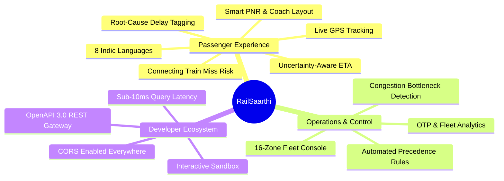

# ✨ RailSaarthi (RailDristhi) — Features & Capabilities Catalog

A deep-dive technical overview of all end-user and operational features implemented in **RailSaarthi**.

---

## 📑 Feature Matrix

---

## 🌟 1. Real-Time Spatial Train Tracking & GPS Route Maps

- **Interactive Canvas & Vector Geo-Maps**:
  - Live train position rendering along exact railway tracks with coordinate interpolation.
  - Smooth animation representing real train movement at current speed ($km/h$).
  - Station markers with halt duration, scheduled vs actual arrival, platform number, and distance traveled.
- **Halt-by-Halt Interactive Timeline**:
  - Visual status color codes: `Completed` (Green), `In Transit / Next Halt` (Amber/Pulse), `Upcoming` (Slate).
  - Countdown clock to the next upcoming station with speed and distance remaining.

---

## 🧠 2. Uncertainty-Aware ETA Forecasting Engine

- **Point-Estimates vs Confidence Intervals**:
  - Standard apps display rigid, misleading single timestamps (e.g. `14:30`) that are almost always wrong during delays.
  - RailSaarthi computes an **$80\%$ Confidence Interval Window** (e.g., `Expected between 14:24 and 14:42`), giving passengers realistic planning horizons.
- **Multi-Factor Convergence Algorithm**:
  - Incorporates station historical delay scrape baselines.
  - Weights prior halts on the current run to detect whether delays are accumulating or recovering.
  - Adjusts for weather events (dense fog, monsoons) and peak hour junction traffic.

---

## 🏷️ 3. Semantic Delay Cause Classifier

Decomposes abstract train delays into actionable root-cause diagnoses:
1. 🌧️ **Adverse Weather**: Heavy rainfall, dense northern winter fog, or cyclonic track restrictions.
2. 🚦 **Corridor Congestion**: Peak hour section traffic and suburban local train precedence bottlenecks.
3. 🚧 **Track Maintenance / Caution Orders**: Speed restrictions due to ballast packing or rail renewal.
4. 🔴 **Signal & Interlocking Failure**: Points failure or red signal stop at outer junctions.
5. ⚙️ **Loco / OHE Technical Glitch**: Locomotive power trip or Overhead Equipment tensioning issues.
6. ⏱️ **Operational Variance**: Minor transit adjustments and platform clearance delays.

---

## 🔄 4. Connecting Train Miss Risk & Transfer Analyzer

- **Junction Transfer Feasibility Assessment**:
  - Passengers input incoming and outgoing train numbers with the transfer station code.
  - The engine calculates the **Effective Transfer Buffer** by subtracting incoming forecast delays and physical platform transit time.
- **Risk Probability & Color States**:
  - 🟢 **SAFE ($<30\%$ Risk)**: Comfortable margin.
  - 🟡 **RISKY ($30\% - 85\%$ Risk)**: Tight window; displays platform shortcut tips and foot overbridge routes.
  - 🔴 **MISSED ($>85\%$ Risk)**: Inevitable connection loss; queries timetable graph to immediately present the best alternative connecting trains departing from that junction with estimated seat availability.

---

## 🎛️ 5. Central Control Room & Dispatcher Dashboard

- **Pan-India Fleet Telemetry**:
  - Live counts of active running vs halted trains.
  - Fleet-wide On-Time Performance (OTP %) tracker.
  - Average network delay in minutes.
- **16-Zone Filter & Congestion Matrix**:
  - Immediate filter across NR, WR, CR, ER, SR, NCR, ECR, WCR, SCR, SWR, SER, etc.
  - Highlights critical trains running $>60\text{ minutes}$ late with priority clearance suggestions.
- **Delay Cause Distribution Charts**:
  - Recharts interactive bar and pie distributions showing network-wide breakdown of delay factors.

---

## 🎫 6. Smart PNR Intelligence & Berth Allocation

- **Complete Passenger Manifest**:
  - Displays booking status vs current status (`CNF`, `RAC`, `WL`).
  - Coach (`A1`, `B4`, `S2`) and Berth position (`Lower`, `Middle`, `Upper`, `Side Lower`, `Side Upper`).
  - Integrated chart preparation status (`CHART PREPARED`).
- **Live Journey Sync**:
  - Directly attaches the live GPS running status and ETA of the booked train onto the PNR ticket view.

---

## 🌐 7. Indic Multilingual Localization (8 Languages)

Native UI translation support covering India's major linguistic demographics:
- 🇮🇳 **English**
- 🇮🇳 **हिंदी (Hindi)**
- 🇮🇳 **বাংলা (Bengali)**
- 🇮🇳 **తెలుగు (Telugu)**
- 🇮🇳 **मराठी (Marathi)**
- 🇮🇳 **தமிழ் (Tamil)**
- 🇮🇳 **ગુજરાતી (Gujarati)**
- 🇮🇳 **ಕನ್ನಡ (Kannada)**

---

## 🛰️ 8. On-Board GPS & Peer Mesh Sensor Hook (`useOnBoardGps`)

- **Browser-Native Geolocation**:
  - Zero app install required; accesses device GPS via HTML5 Geolocation API with high accuracy mode.
- **Kinematic Dead-Reckoning**:
  - Maintains accurate coordinate updates during tunnel and rural network blind spots.
- **Track Geometry Snapping**:
  - Snaps noisy raw sensor coordinates onto the verified IR route geometry.
